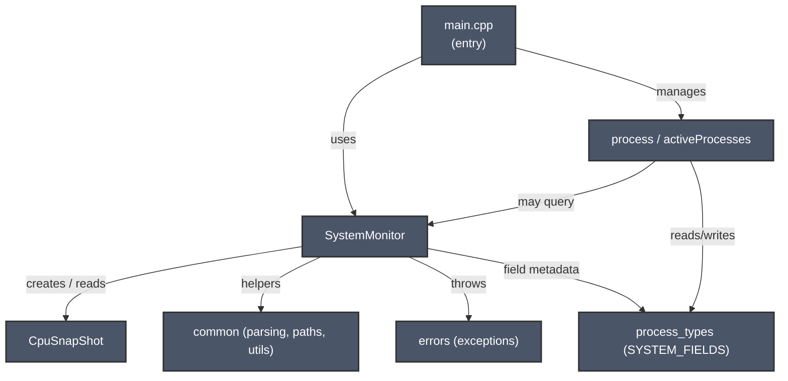

# Architecture

## Overview

MyProcessManager is built around two main components that handle all data management and core functionality:

### **ActiveProcesses**
Manages all user and system processes with the following responsibilities:
- Decides which processes to display
- Manages process lifecycle and operations
- Keeps the process list updated with current state

### **SystemMonitor**
Holds and tracks hardware usage metrics with the following responsibilities:
- Maintains RAM and CPU usage data
- Keeps metrics updated in real-time
- Calculates usage percentages using algorithms and formulas detailed in [SystemMonitor.md](SystemMonitor.md)

Both components work together to provide comprehensive system monitoring through the main entry point. 

## Architecture Diagram

This diagram shows the main components and their relationships in MyProcessManager.

Mermaid diagram (renderable in many Markdown viewers):



ASCII fallback (plain text):

```
Main (main.cpp)
  |
  +--> SystemMonitor
  |      +--> CpuSnapShot
  |      +--> common (parsing, paths, utils)
  |      +--> errors (exceptions)
  |      +--> process_types (field metadata)
  |
  +--> process / activeProcesses
         +--> process_types
         +--> (may query) SystemMonitor
```

Notes
- The `SystemMonitor` component is central: it reads procfs via `common` helpers, parses values into `CpuSnapShot` and uses `process_types` metadata to populate its fields. Errors are reported via the `errors` module. The `main` binary wires `SystemMonitor` and process management (`process` / `activeProcesses`) together.
